# Entity-Relationship Diagram

Generated from the SQLAlchemy models (28 tables). PK = primary key, FK = foreign key, UK = unique. `||--o{` = one-to-many, `|o--o{` = optional one-to-many, `|o--o|` = optional one-to-one.

```mermaid
erDiagram
    addresses {
        string customer_id FK
        string label
        string line1
        string line2
        string city
        string state
        string postal_code
        string country
        bool is_primary
        string id PK
        datetime created_at
        datetime updated_at
    }
    audit_logs {
        string user_id FK
        string action
        string entity
        string entity_id
        text previous_value
        text new_value
        string ip_address
        string id PK
        datetime created_at
        datetime updated_at
    }
    customers {
        string customer_code UK
        string full_name
        string email UK
        string phone UK
        date date_of_birth
        enum customer_type
        enum kyc_status
        string kyc_document_type
        string kyc_document_number
        bool is_active
        string id PK
        datetime created_at
        datetime updated_at
        bool is_deleted
        datetime deleted_at
    }
    devices {
        string imei UK
        string model
        string manufacturer
        enum device_type
        enum status
        string customer_id FK
        string sim_id FK,UK
        string id PK
        datetime created_at
        datetime updated_at
    }
    network_equipment {
        string tower_id FK
        string name
        enum equipment_type
        date installation_date
        date maintenance_schedule
        float cpu_usage_percent
        float memory_usage_percent
        enum status
        datetime last_heartbeat
        string id PK
        datetime created_at
        datetime updated_at
    }
    notifications {
        string recipient_user_id FK
        string recipient_customer_id FK
        enum notification_type
        string title
        text message
        bool is_read
        string id PK
        datetime created_at
        datetime updated_at
    }
    outage_affected_customers {
        string outage_id FK
        string customer_id FK
        bool notified
        string id PK
        datetime created_at
        datetime updated_at
    }
    outage_towers {
        string outage_id PK,FK
        string tower_id PK,FK
    }
    outages {
        string title
        text description
        enum outage_type
        enum severity
        enum status
        datetime start_time
        datetime expected_resolution
        datetime actual_resolution
        string id PK
        datetime created_at
        datetime updated_at
    }
    password_reset_tokens {
        string id PK
        string user_id FK
        string token
        bool used
        datetime expires_at
        datetime created_at
        datetime updated_at
    }
    refresh_tokens {
        string id PK
        string jti UK
        string user_id FK
        datetime expires_at
        bool revoked
        datetime created_at
        datetime updated_at
    }
    service_plans {
        string name
        string code UK
        text description
        enum plan_type
        enum category
        float price
        int validity_days
        int data_limit_mb
        int voice_limit_minutes
        int sms_limit_count
        enum status
        bool is_featured
        string id PK
        datetime created_at
        datetime updated_at
    }
    service_request_history {
        string request_id FK
        string from_status
        string to_status
        text notes
        string id PK
        datetime created_at
        datetime updated_at
    }
    service_requests {
        string request_code UK
        string customer_id FK
        enum request_type
        enum status
        text details
        text payload
        string id PK
        datetime created_at
        datetime updated_at
    }
    sim_cards {
        string sim_number UK
        enum sim_type
        enum status
        datetime activation_date
        string customer_id FK
        string current_plan_id FK
        string serving_tower_id FK
        string id PK
        datetime created_at
        datetime updated_at
    }
    sim_replacements {
        string old_sim_id FK
        string new_sim_id FK
        string customer_id FK
        text reason
        string id PK
        datetime created_at
        datetime updated_at
    }
    sla_rules {
        enum ticket_category
        enum priority
        enum customer_type
        int response_time_minutes
        int resolution_time_minutes
        string id PK
        datetime created_at
        datetime updated_at
    }
    sla_tracking {
        string ticket_id FK,UK
        string sla_rule_id FK
        datetime sla_start_time
        datetime sla_deadline
        datetime resolved_time
        bool breached
        bool escalated
        string id PK
        datetime created_at
        datetime updated_at
    }
    subscription_history {
        string subscription_id FK
        string action
        string from_plan_id FK
        string to_plan_id FK
        text notes
        string id PK
        datetime created_at
        datetime updated_at
    }
    subscriptions {
        string customer_id FK
        string sim_id FK
        string plan_id FK
        enum status
        datetime start_date
        datetime end_date
        bool auto_renew
        string id PK
        datetime created_at
        datetime updated_at
    }
    technician_assignments {
        string technician_id FK
        enum target_type
        string target_id
        enum status
        datetime assigned_at
        datetime completed_at
        text notes
        string id PK
        datetime created_at
        datetime updated_at
    }
    technicians {
        string user_id FK,UK
        string full_name
        string phone
        string skills
        string service_area
        float latitude
        float longitude
        enum availability_status
        string id PK
        datetime created_at
        datetime updated_at
    }
    ticket_comments {
        string ticket_id FK
        string author_id FK
        bool is_internal
        text body
        string id PK
        datetime created_at
        datetime updated_at
    }
    ticket_history {
        string ticket_id FK
        string action
        string actor_id FK
        string from_value
        string to_value
        string id PK
        datetime created_at
        datetime updated_at
    }
    tickets {
        string ticket_code UK
        string customer_id FK
        enum category
        string subject
        text description
        enum status
        enum priority
        string assigned_agent_id FK
        string assigned_technician_id FK
        string related_sim_id FK
        string related_device_id FK
        bool escalated
        text resolution_notes
        datetime resolved_at
        datetime closed_at
        string id PK
        datetime created_at
        datetime updated_at
    }
    towers {
        string code UK
        string name
        enum tower_type
        float latitude
        float longitude
        float coverage_radius_km
        int capacity
        enum status
        string id PK
        datetime created_at
        datetime updated_at
    }
    usage_records {
        string subscription_id FK
        string sim_id FK
        date usage_date
        float data_used_mb
        float voice_used_minutes
        int sms_used_count
        string id PK
        datetime created_at
        datetime updated_at
    }
    users {
        string email UK
        string full_name
        string phone
        string hashed_password
        enum role
        bool is_active
        string customer_id FK,UK
        string id PK
        datetime created_at
        datetime updated_at
    }
    customers ||--o{ addresses : "customer_id"
    users |o--o{ audit_logs : "user_id"
    customers |o--o{ devices : "customer_id"
    sim_cards |o--o| devices : "sim_id"
    towers ||--o{ network_equipment : "tower_id"
    customers |o--o{ notifications : "recipient_customer_id"
    users |o--o{ notifications : "recipient_user_id"
    customers ||--o{ outage_affected_customers : "customer_id"
    outages ||--o{ outage_affected_customers : "outage_id"
    outages ||--o| outage_towers : "outage_id"
    towers ||--o| outage_towers : "tower_id"
    users ||--o{ password_reset_tokens : "user_id"
    users ||--o{ refresh_tokens : "user_id"
    service_requests ||--o{ service_request_history : "request_id"
    customers ||--o{ service_requests : "customer_id"
    service_plans |o--o{ sim_cards : "current_plan_id"
    customers |o--o{ sim_cards : "customer_id"
    towers |o--o{ sim_cards : "serving_tower_id"
    customers ||--o{ sim_replacements : "customer_id"
    sim_cards ||--o{ sim_replacements : "new_sim_id"
    sim_cards ||--o{ sim_replacements : "old_sim_id"
    sla_rules ||--o{ sla_tracking : "sla_rule_id"
    tickets ||--o| sla_tracking : "ticket_id"
    service_plans |o--o{ subscription_history : "from_plan_id"
    subscriptions ||--o{ subscription_history : "subscription_id"
    service_plans |o--o{ subscription_history : "to_plan_id"
    customers ||--o{ subscriptions : "customer_id"
    service_plans ||--o{ subscriptions : "plan_id"
    sim_cards ||--o{ subscriptions : "sim_id"
    technicians ||--o{ technician_assignments : "technician_id"
    users |o--o| technicians : "user_id"
    users ||--o{ ticket_comments : "author_id"
    tickets ||--o{ ticket_comments : "ticket_id"
    users |o--o{ ticket_history : "actor_id"
    tickets ||--o{ ticket_history : "ticket_id"
    users |o--o{ tickets : "assigned_agent_id"
    technicians |o--o{ tickets : "assigned_technician_id"
    customers ||--o{ tickets : "customer_id"
    devices |o--o{ tickets : "related_device_id"
    sim_cards |o--o{ tickets : "related_sim_id"
    sim_cards ||--o{ usage_records : "sim_id"
    subscriptions ||--o{ usage_records : "subscription_id"
    customers |o--o| users : "customer_id"
```

